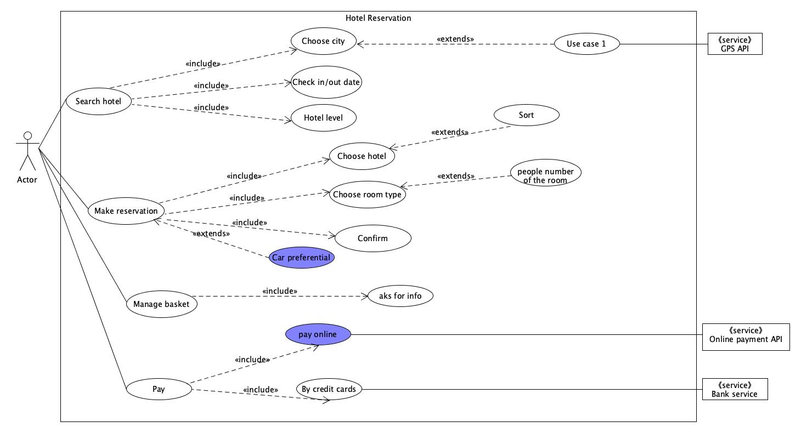

1、简答题

1. 用例的概念

   用例（Use Case）：是一种通过用户的使用场景来获取需求的技术。一个用例定义了外部执行者和被考虑的系统之间的交互来实现一个业务目标，用例描述了满足业务目标的业务活动，没有涉及特定的实现寓言并且要求合适的细节级别。

2. 用例和场景的关系？什么是主场景或 happy path？

   每个用例提供一个或多个场景，该场景说明了系统是如何和最终用户或其他系统互动，也就是谁可以用系统做什么。 参与者在用例中所遵循的主逻辑路径，描述了各项工作都正常进行时用例的工作方式，所以通常称为主场景或happy path

3. 用例有哪些形式？

   - Brief：

     提供一段通过关于主要的happy path总结。可以快速构建，在需求的早期提供主题和范围的快速了解。

   - Casual：

     非正式的段落格式，包含多种场景的多个段落，比brief use case相比具有更多的细节，但无法被用作正式的用例文本。

   - Fully：

     所有的步骤和变化都详细的写出，并且有支持部分，例如先决条件和成功保证。

4. 对于复杂业务，为什么编制完整用例非常难？

   因为复杂的业务涉及到的场景非常多，并且各个场景之间也有彼此的关联，因此这给编制一个完整的用例带来了很大的困难，业务人员不仅要熟悉各种业务场景的流程，分析构建一个场景的细节也至关重要。

5. 什么是用例图？

   是用户与系统交互的最简表示形式，展现了用户和与他相关的用例之间的关系。通过用例图，人们可以获知系统不同种类的用户和用例。

6. 用例图的基本符号与元素？

   - 参与者(Actor),表示的是一个系统用户，也就是与应用程序进行交互的用户、组织或者外部系统。
   - 用例(Use Case)：表示的是对系统提供功能、服务的一种描述。
   - 用例关系：
     - 包含关系(include)：表示用例可以简单地包含其他用例所具有的行为
     - 泛化关系(Generalization)：值一个父用例可以被特化形成多个子用例
     - 关联关系(Association)：表示的是参与者与用例之间的关系
     - 扩展/延伸关系(Extend)：表示在一定条件下，把新的行为加入到已有的用例中，获得的新用例叫做扩展用例。

7. 用例图的画法与步骤

   1. 确定研讨的系统、系统的参与者；哪些人会使用这个系统、系统需要从哪些人或其他系统中获得数据….
   2. 确定用例，根据参与者来确定系统的用例，主要是看各参与者需要系统提供什么样的服务，或者说参与者是如何使用系统的。
   3. 描述用例规约，描述每一个有例的详细信息，这些信息包含在用例规约中，用例模型是由用例图和每一个用例的详细描述――用例规约所组成的。
   4. 检查用例模型，用例模型完成之后，可以对用例模型进行检查，看看是否有遗漏或错误之处。

8. 用例图给利益相关人与开发者的价值有哪些？

   - 对于利益相关人：
     - 可以直观的反应系统的功能结构，保证系统按照需求进行设计
     - 用例通常使用结构化模板编写，辅以可视化UML图标，促进利益相关人与开发者进行的沟通，根据需求的复杂程度对程序进行细节上的增减调节，及时响应用户。
   - 对于开发者：
     - 用例图为开发者提供了一个清晰的开发蓝图，提高系统的开发效率和质量
     - 用例图可以指导开发和测试，在整个过程中对工作流起指导作用

2、建模练习题（用例模型）

- 选择2-3个你熟悉的类似业务的在线服务系统（或移动 APP），如定旅馆（携程、去哪儿等）、定电影票、背单词APP等，分别绘制它们用例图。并满足以下要求：
  - 请使用用户的视角，描述用户目标或系统提供的服务
  - 粒度达到子用例级别，并用 include 和 exclude 关联它们
  - 请用色彩标注出你认为创新（区别于竞争对手的）用例或子用例
  - 尽可能识别外部系统和服务

1. 携程：

   

2. 订电影票：

- 然后，回答下列问题：
  1. 为什么相似系统的用例图是相似的？
  2. 如果是定旅馆业务，请对比 Asg_RH 用例图，简述如何利用不同时代、不同地区产品的用例图，展现、突出创新业务和技术
  3. 如何利用用例图定位创新思路（业务创新、或技术创新、或商业模式创新）在系统中的作用
  4. 请使用 SCRUM 方法，选择一个用例图，编制某定旅馆开发的需求（backlog）开发计划表
  5. 根据任务4，参考 [使用用例点估算软件成本](https://www.ibm.com/developerworks/cn/rational/edge/09/mar09/collaris_dekker/index.html)，给出项目用例点的估算