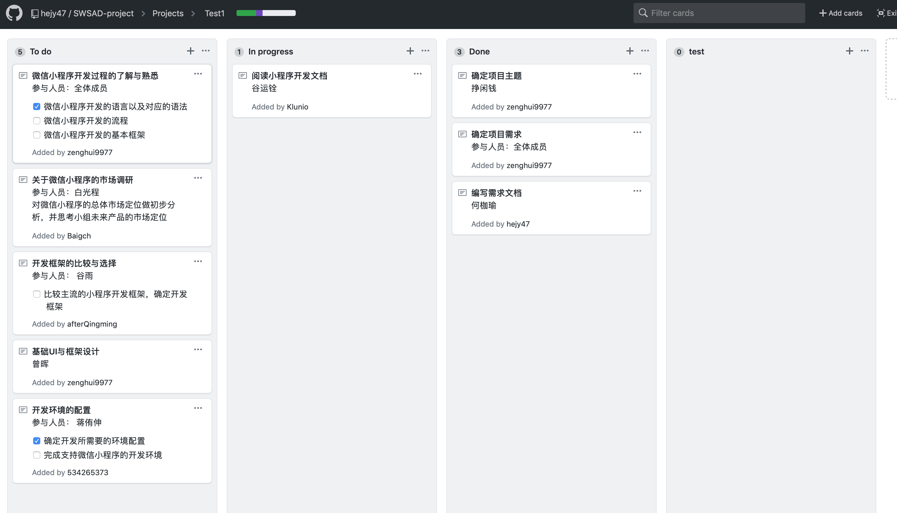
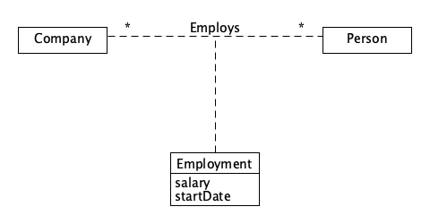

1、简答题

- 用简短的语言给出对分析、设计的理解。
  - 分析：在研究程序或需求的过程中，把事务、概念分解成较简单的组成部分，分别加以考察，找出各自的本质属性和彼此间的联系
  - 设计：指预先描绘出工作结果的样式、结构及形貌。
- 用一句话描述面向对象的分析与设计的优势。
  - 面向对象的分析利用面向对象的信息建模概念，将对象作为程序的基本单元，将程序和数据封装其中，提高软件的重用性、灵活性和扩展性
- 简述 UML（统一建模语言）的作用。考试考哪些图？
  - UML是一种开放的方法，用于说明、可视化、构建和编写一个正在开发的、面向对象的、软件密集系统的制品的开放方法。
  - Structure diagrams（结构图）、Behavior diagrams（行为图）、Interaction diagrams（交互图）
- 从软件本质的角度，解释软件范围（需求）控制的可行性
  - 虽然软件本身的复杂性、不可见性、不一致性、可变性，在软件开发的过程，软件开发者围绕客户目标，发现并满足客户感兴趣的内容，实现软件最具创造价值的功能，因此软件范围控制是可行的。

2、项目管理实践

- 看板使用练习（提交看板执行结果贴图，建议使用 Git project）

  - 使用截图工具（png格式输出），展现你团队的任务 Kanban
  - 每个人的任务是明确的。必须一周后可以看到具体结果
  - 每个人的任务是1-2项
  - 至少包含一个团队活动任务

  

- UML绘图工具练习（提交贴图，必须使用 UMLet）

  - 请在 参考书2 或 教材 中选择一个类图（给出参考书页码图号）

###### From 《UML和模式应用》P193 图16-16 

